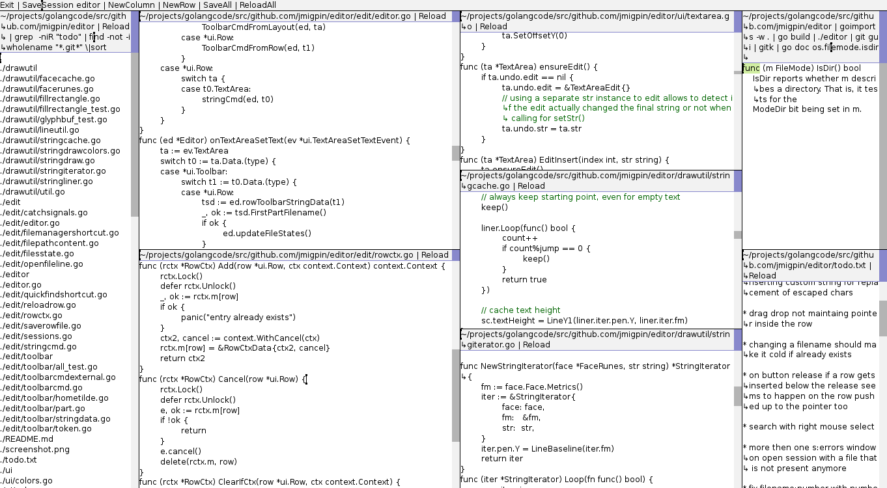
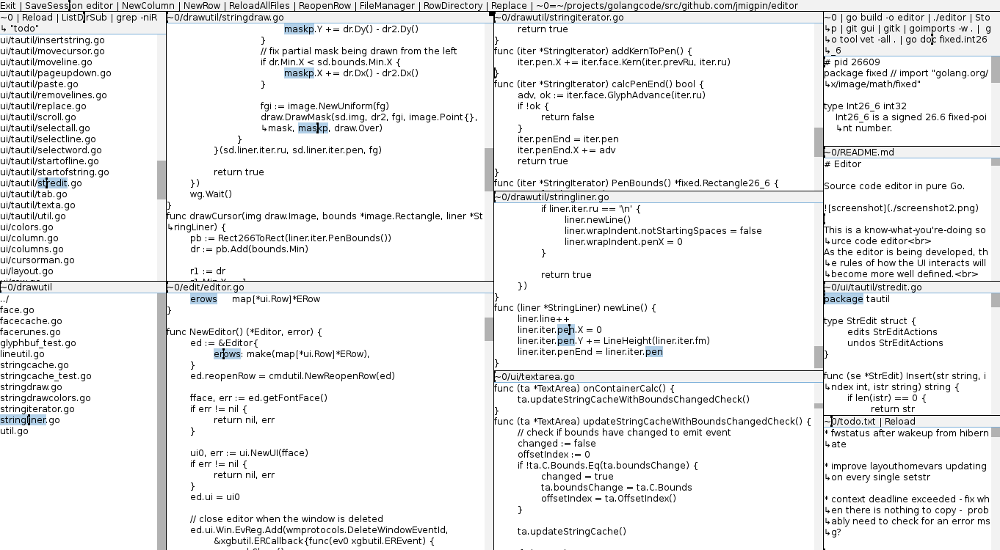
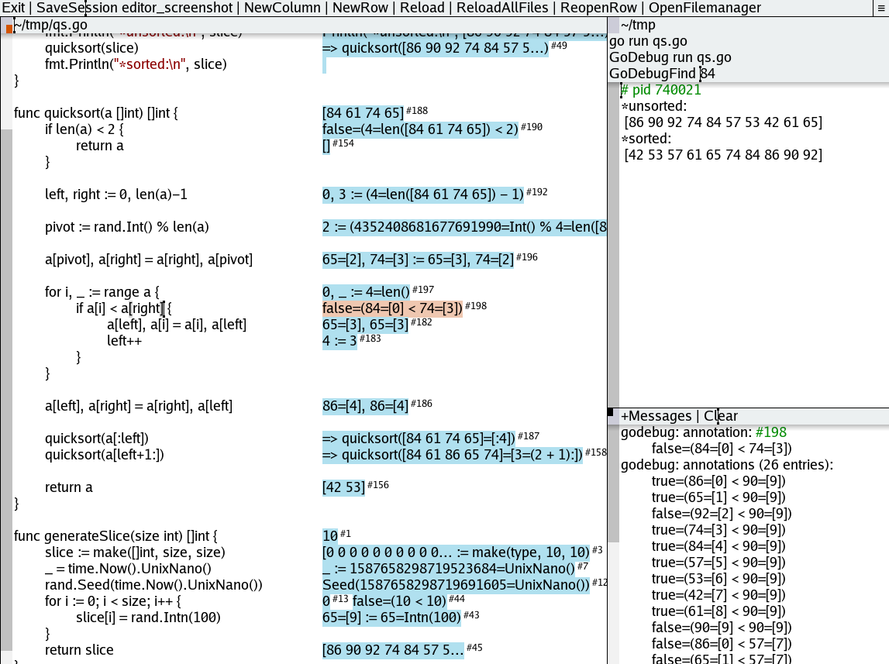
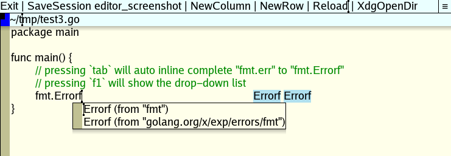

# Editor

Source code editor in pure Go.









## About

- This is a simple but advanced source code editor
- As the editor is being developed, the rules of how the UI interacts will become more well defined.
- Primarily developed and tested in Linux. 
- Works in MS Windows (native or xserver) and MacOS (xserver).

## Features

- Auto-indentation of wrapped lines.
- No code coloring (except comments and strings).
- Many TextArea utilities: undo/redo, replace, comment, ...
- Handles big files.
- Start external processes from the toolbar with a click, capturing the output to a row. 
- Drag and drop files/directories to the editor.
- Detects if files opened are changed outside the editor.
- Plugin support
	- examples such as `gotodefinition` and `autocomplete` [below](#plugins).
- Golang specific:
	- Calls goimports if available when saving a .go file.
	- Clicking on `.go` files identifiers will jump to the identifier definition (needs `gopls`).
	- Debug utility for go programs (`GoDebug` cmd).
		- allows to go back and forth in time to consult code values.
- Language Server Protocol (LSP) (code analysis):
	- `-lsproto` cmd line option
	- basic support for gotodefinition and completion
	- mostly being tested with `clangd` and `gopls`
- Inline complete
	- code completion by hitting the `tab` key (uses LSP).

## Installation

### Instalation with git

Get with `git` the latest from the default master branch:
```
git clone https://github.com/jmigpin/editor
```
Build and run:
```
cd ./editor
go build
./editor
```
Windows platform compilation alternatives:
```
go build				# shows one console window (will be hidden, but makes a flash)
go build -ldflags -H=windowsgui		# hides the console window, but cmds will popup consoles
go build -tags=xproto 			# (not native, needs an x11 server to run)
```

### Instalation with go tooling to be used as a library 

```
go get -u github.com/jmigpin/editor
```

Please take care to distinguish between versions and ensure "go get" is actually getting the version you want.

This project is not using "vX" named directories. So version 3 is not in the directory "v3", nor is it named "*/v3" in imports. Versions are being updated using the same import path. The downside of this is that go websites (ex: pkg.go.dev) don't recognize versions tagged as 3 and above of this project. 

Currently a release will be tagged with two tags that refer to the same version (ex: 3.3.0 and 1.3.3 is the same version). 

Feel free to file an issue if you know of a better solution that doesn't require to use an import path of a directory that might not exist (case of using "vX" import paths).

## Usage

<!-- __usageSectionStart__ -->
```
Usage of editor:
  -colortheme string
    	available: light, acme, lightInverted, acmeInverted (default "light")
  -commentscolor int
    	Colorize comments. Can be set to 0x1 to not colorize. Ex: 0xff0000=red.
  -cpuprofile string
    	profile cpu filename
  -dpi float
    	monitor dots per inch (default 72)
  -font string
    	font: regular, medium, mono, or a filename (default "regular")
  -fonthinting string
    	font hinting: none, vertical, full (default "full")
  -fontsize float
    	 (default 12)
  -lsproto value
    	Language-server-protocol register options. Can be specified multiple times.
    	Format: language,fileExtensions,network{tcp|tcpclient|stdio},command,optional{stderr,nogotoimpl}
    	Format notes:
    		if network is tcp, the command runs in a template with vars: {{.Addr}}.
    		if network is tcpclient, the command should be an ipaddress.
    	Examples:
    		go,.go,stdio,"gopls serve"
    		go,.go,tcp,"gopls serve -listen={{.Addr}}"
    		cpp,".c .h .cpp .hpp .cc",stdio,"clangd"
    		python,.py,stdio,pylsp
    		python,.py,tcpclient,127.0.0.1:9000
    		python,.py,stdio,pylsp,"stderr nogotoimpl"
  -plugins string
    	comma separated string of plugin filenames
  -presavehook value
    	Run program before saving a file. Uses stdin/stdout. Can be specified multiple times. By default, a "goimports" entry is auto added if no entry is defined for the "go" language.
    	Format: language,fileExtensions,cmd
    	Examples:
    		go,.go,goimports
    		cpp,".cpp .hpp","\"clang-format --style={'opt1':1,'opt2':2}\""
    		python,.py,python_formatter
  -scrollbarleft
    	set scrollbars on the left side (default true)
  -scrollbarwidth int
    	Textarea scrollbar width in pixels. A value of 0 takes 3/4 of the font size.
  -sessionname string
    	open existing session
  -shadows
    	shadow effects on some elements (default true)
  -sn string
    	open existing session
  -stringscolor int
    	Colorize strings. Can be set to 0x1 to not colorize. Ex: 0xff0000=red.
  -tabwidth int
    	 (default 8)
  -usemultikey
    	use multi-key to compose characters (Ex: [multi-key, ~, a] = ã)
  -version
    	output version and exit
  -wraplinerune int
    	code for wrap line rune, can be set to zero (default 8592)
```
 <!-- __usageSectionEnd__ -->

The editor has no configuration file. Use it within a script with your preferences (example `editor.sh`):

```
#!/bin/sh
exec ~/path/editor \
--dpi=143 \
--fontsize=9 \
--colortheme=acme \
--commentscolor=0x008b00 \
--stringscolor=0x8b3100 \
--lsproto=go,.go,stdio,"gopls serve" \
--lsproto="cpp,\".c .h .cpp .hpp .cc\",stdio,clangd" \
--presavehook=go,.go,goimports \
--presavehook="cpp,\".c .h .cpp .hpp\",\"clang-format --someoption\"" \
"$@"
```

## Basic Layout

The editor has a top toolbar and columns. Columns have rows. Rows have a toolbar and a textarea.

These row toolbars are also textareas where clicking (`buttonRight`) on the text will run that text as a command.

The row toolbar has a square showing the state of the row.

## Toolbar usage examples

Commands in toolbars are separated by "|" (not to be confused with the shell pipe). If a shell pipe is needed it should be escaped with a backslash.

All internal commands start with an **Uppercase letter**. Otherwise it tries to run an existent external program. 

Examples:
- `~/tmp/subdir/file1.txt | ls`
Clicking at `ls` will run `ls` at `~/tmp/subdir`
- `~/tmp/subdir/file1.txt | ls -l \| grep fi`
Notice how "|" is escaped, allowing to run `ls -l | grep fi`
- `~/tmp/subdir/file1.txt`
Clicking at `file1.txt` opens a new row to edit the same file.
Clicking at `~/tmp` opens a new row located at that directory.
- `gorename -offset $edFileOffset -to abc`
Usage of external command with active row position as argument.
[gorename godoc](https://godoc.org/golang.org/x/tools/cmd/gorename), [go tools](https://github.com/golang/tools).
- `guru -scope fmt callers $edFileOffset`
Usage of external command with active row position as argument.
[guru godoc](https://godoc.org/golang.org/x/tools/cmd/guru), [go tools](https://github.com/golang/tools).
- `grep -niIR someword`
Grep results with line positions that are clickable.
- `xdg-open $edDir`
Open favorite external application with active row directory.
- `xterm`
Open an xterm at the active row directory.
- `$font=mono`
Use monospaced font in this row textarea (see more at [internal variables](#internal-variables)).

## Commands

*Toolbar commands*

- `ListSessions`: lists saved sessions
- `SaveSession <name>`: save session to ~/.editor_sessions.json
- `DeleteSession <name>`: deletes the session from the sessions file
- `NewColumn`: opens new column
- `NewRow`: opens new empty row located at the active-row directory, or if there is none, the current directory. Useful to run commands in a directory.
- `ReopenRow`: reopen a previously closed row
- `SaveAllFiles`: saves all files
- `ReloadAll`: reloads all filepaths
- `ReloadAllFiles`: reloads all filepaths that are files
- `ColorTheme`: cycles through available color themes.
- `FontTheme`: cycles through available font themes.
- `Exit`: exits the program
- `Version`: shows editor version in the messages row

*Row toolbar commands*

These commands run on a row toolbar, or on the top toolbar with the active-row.

- `NewFile <name>`: create (and open) new file at the row directory. Fails it the file already exists.
- `Save`: save file
- `Reload`: reload content
- `CloseRow`: close row
- `CloseColumn`: closes row column
- `Find`: find string (ignores case)
- `GotoLine <num>`: goes to line number
- `Replace <old> <new>`: replaces old string with new, respects selections
- `Stop`: stops current process (external cmd) running in the row
- `ListDir [-sub] [-hidden]`: lists directory
	- `-sub`: lists directory and sub directories
	- `-hidden`: lists directory including hidden
- `MaximizeRow`: maximize row. Will push other rows up/down.
- `CopyFilePosition`: output the cursor file position in the format "file:line:col". Useful to get a clickable text with the file position.
- `RuneCodes`: output rune codes of the current row text selection.
- `FontRunes`: output the current font runes.
- `OpenExternal`: open the row with the preferred external application (ex: useful to open an image, pdf, etc).
- `OpenFilemanager`: open the row directory with the external filemanager.
- `OpenTerminal`: open the row directory with the external terminal.
- `LsprotoCloseAll`: closes all running lsp client/server connections. Next call will auto start again. Useful to stop a misbehaving server that is not responding.
- `LsprotoRename <new-name>`: Renames the identifiers under the text cursor using the loaded lsp instance. Uses the row/active-row filename, and the cursor index as the "offset" argument.
- `LsprotoCallers`: lists callers of the identifier under the text cursor using the loaded lsp instance. Uses the row/active-row filename, and the cursor index as the "offset" argument. Also known as: call hierarchy incoming calls.
- `LsprotoCallees`: lists callees of the identifier under the text cursor using the loaded lsp instance. Uses the row/active-row filename, and the cursor index as the "offset" argument. Also known as: call hierarchy outgoing calls.
- `LsprotoReferences`: lists references of the identifier under the text cursor using the loaded lsp instance. Uses the row/active-row filename, and the cursor index as the "offset" argument.
- `GoRename [-all] <new-name>`: Renames the identifier under the text cursor. Uses the row/active-row filename, and the cursor index as the "offset" argument. Reloads the calling row at the end if there are no errors.
	- default: calls `gopls` (limited scope in renaming, but faster).
	- `-all`: calls `gorename` to rename across packages (slower).
- `GoDebug <command> [arguments]`: debugger utility for go programs (more at [commands:godebug](#commands-godebug))
- `GoDebugFind <string>`: find string in current selected annotation. Useful to rewind the annotations to the desired point.

*Row name at the toolbar (usually the filename)*

- Clicking on a section of the path of the filename will open a new row with that content. Ex: if a row filename is "/a/b/c.txt" clicking on "/a" will open a new row with that directory listing, while clicking on "/a/b/c.txt" will open another row to edit the same file.

*Textarea commands*

- `OpenSession <name>`: opens previously saved session
- `<url>`: opens url in preferred application.
- `<filename(:number?)(:number?)>`: opens filename, possibly at line/column (usual output from compilers). Check common locations like `$GOROOT` and C include directories.
	- If text is selected, only the selection will be considered as the filename to open.
- `<identifier-in-a-.go-file>`: opens definition of the identifier. Ex: clicking in `Println` on `fmt.Println` will open the file at the line that contains the `Println` function definition.

## Commands: GoDebug

Output of `GoDebug -help`:
```
Usage:
	GoDebug <command> [arguments]
The commands are:
	run		build and run program with godebug data
	test		test packages compiled with godebug data
	build 	build binary with godebug data (allows remote debug)
	connect	connect to a binary built with godebug data (allows remote debug)
Env variables:
	GODEBUG_BUILD_FLAGS	comma separated flags for build
Examples:
	GoDebug -help
	GoDebug run -help
	GoDebug run main.go -arg1 -arg2
	GoDebug run -dirs=dir1,dir2 -files=f1.go,f2.go main.go -arg1 -arg2
	GoDebug test -help
	GoDebug test
	GoDebug test -run mytest
	GoDebug build -addr=:8008 main.go
	GoDebug connect -addr=:8008
	GoDebug run -env=GODEBUG_BUILD_FLAGS=-tags=xproto main.go
```

Output of `GoDebug run -help`:
```
Usage of GoDebug run:
  -dirs string
    	comma-separated string of directories to annotate
  -env string
    	string with env variables (ex: "GOOS=os:..."'
  -files string
    	comma-separated string of files to annotate
  -syncsend
    	Don't send msgs in chunks (slow). Useful to get msgs before a crash.
  -toolexec string
    	execute cmd, useful to run a tool with the output file (ex: wine outputfilename)
  -verbose
    	verbose godebug
  -work
    	print workdir and don't cleanup on exit
```

- Annotate files
	- By default, the main file will be annotated. Other files/directories can be added with the `-dirs` and `-files` command line options, or by inserting one of the following comments in the code (notice the lack of space after "//"):
		```
		//godebug:annotateoff		# disable annotating
		//godebug:annotateblock
		//godebug:annotatefile
		//godebug:annotatepackage
		//godebug:annotatemodule
		//godebug:annotateimport 	# use before an "import" line
		
		# or specify a target
		//godebug:annotatefile:<file> 	# absolute or relative to the current
		//godebug:annotatepackage:<pkg-path>
		//godebug:annotatemodule:<pkg-path> 	# any pkg path inside will annotate all
		
		# example:
		//godebug:annotatepackage:golang.org/x/tools/godoc/util
		```
		
		The annotator will detect these comments and annotate accordingly. 
		
		Packages located in $GOROOT are not annotated. 
		
		Higher level `//godebug:*` comments will override lower ones.
		
		Example on how to bypass loops that would become too slow with debug messages being sent:
		
		```
		//godebug:annotateoff	// don't annotate arg "v1"
		func fn(v1 int){
			//godebug:annotateblock		// re-enable annotations
			a:=0 // annotated
			if a==0{
				a++ // annotated
				//godebug:annotateoff
				a+=2 // *not* annotated
				a+=3 // *not* annotated
				for i:=0; i<10000;i++{
					// *not* annotated
				}
			}
			println(a) // annotated, not part of the disabled block
		}
		```
		
		Also, to improve on the `String()` limitation:
		
		```
		type myint int
		func (v myint) String() string {
			return f1(v)
		}
		// would cause endless loop with godebug calling t.String() at arg `v`
		// but not if it the annotations are off
		//godebug:annotateoff
		func fn(v myint) string { 
			return fmt.Sprintf("%d", v) 
		}
		```
- Limitations:
	- `String()` and `Error()` methods are not annotated to avoid endless loops (the annotation would recursively call the method again).
		- NOTE: The latest annotator annotates String() and Error() at the cost of not calling these methods to produce the debug msgs themselves. So the debug msgs will not show the String() output but simply the content of the variable. This will later be possible to use again with a command line option, with which these methods will then not be annotated to avoid endless loops.
- Notes:
	- Use `esc` key to stop the debug session. Check related shortcuts at the key/buttons shortcuts section.
	- Supports remote debugging (check help usage with `GoDebug -h`).
		- The annotated executable pauses if a client is not connected. In other words, it stops sending debug messages until a client connects.
		- A client can connect/disconnect any number of times, but there can be only one client at a time.
	- Example usage of setting the env var in a godebug session:
		```
		GoDebug run -env=GO111MODULE=off main.go
		```
		The example below builds a binary for windows in another platform, for later remote debug:
		```
		GoDebug build -env=GOOS=windows -addr=:8008 main.go
		... (copy the binary to the target platform and run it) ...
		GoDebug connect -addr=:8008
		```

## Internal variables

- `~<digit>=path`: Replaces long row filenames with the variable. Ex.: a file named `/a/b/c/d/e.txt` with `~0=/a/b/c` defined in the top toolbar will be shortened to `~0/d/e.txt`.
- `$font=<name>[,<size>]`: sets the row textarea font when set on the row toolbar. Useful when using a proportional font in the editor but a monospaced font is desired for a particular program output running in a row. Ex.: `$font=mono`.
- `$termFilter`: same as `$terminal=f`
- `$terminal={f,k}`: enable terminal features.
	- `f`: Filter (remove) escape sequences from the output. Currently only the clear display sequence is interpreted in this mode which clears the output (usefull for running programs that want to discard old ouput).
	- `k`: redirect keyboard input to the running program to enable reading from standard input. Note: typing keys will not be seen in the textarea unless the running program outputs them (exceptions: "\n") .

## Environment variables set available to external commands

- `$edName`: row name. 
- `$edDir`: row directory. 
- `$edFileOffset`: filename with offset position from active row cursor. Ex: "filename:#123".
- `$edFileLine`: index line from active row cursor (1-based). Ex: "12".
- `$edFileWord`: word at index from active row cursor. Ex: "myvar". Usage ex: use `go doc $edFileWord` with cursor at a receiver variable.
- `$<name>=<string>`: set custom variable in a row toolbar to be set in the environment when running an external command.<br>
	Example row toolbar:
	```
	$myprog="a.out -arg1"
	$myprog -arg2 | echo a${myprog}b
	```
	Clicking on `$myprog -arg2` will have the shell run `a.out -arg1 -arg2`.<br>
	Clicking on `echo a${myprog}b` will result in echoing `aa.out -arg1b`.

## Row states

- background colors:
	- `blue`: row file has been edited.
	- `orange`: row file doesn't exist.
- dot colors:
	- `black`: row currently active. There is only one active row.
	- `red`: row file was edited outside (changed on disk) and doesn't match last known save. Use `Reload` cmd to update.
	- `blue`: there are other rows with the same filename (2 or more).
	- `yellow`: there are other rows with the same filename (2 or more). Color will change when the pointer is over one of the rows.

## Plugins

Plugins allow extra functionality to be added to the editor without changing the binary. 

A plugin can be compiled and run with (will output a `*.so`):
```
go build -buildmode=plugin plugin1.go
go build -buildmode=plugin plugin2.go
editor --plugins plugin1.so,plugin2.so
```

Functions that can be implemented by a plugin are (subject to changes - __work-in-progress__ ):
```
func OnLoad(ed *core.Editor)
func AutoComplete(ctx context.Context, ed *core.Editor, cfb *ui.ContextFloatBox) (err error, handled bool) // error` is only considered if `handled` is true
func ToolbarCmd(ed *core.Editor, erow *core.ERow, part *toolbarparser.Part) bool
```

Note that plugins might need to be recompiled everytime there are changes in the libraries provided by the editor.

Editor events currently implemented (subject to changes - __work-in-progress__ ):
```
PostNewERowEEventId // on erow creation
PostFileSaveEEventId // after a file is saved
PreRowCloseEEventId // before a row is closed
RowStateChangeEEventId // on row state change (duplicate rows also emit).

```

Plugins located at: `./plugins`.
- `gotodefinition_godef.go`: plugin that shows how to override the textarea click action and use godef instead of the default.
- `autocomplete_gocode.go`: plugin that shows a context with suggestions for `.go` files (uses gocode).
- `rownames.go`: example plugin that shows how to access row names.
- `eevents.go`: example plugin on how to access editor events.

## Key/button shortcuts

*Global key/button shortcuts*

- `esc`:
	- stop debugging session
	- close context float box
	- cancels any cmds running (content,internal,preSaveHooks,...)
- `f1`: toggle context float box
	- triggers call to plugins that implement `AutoComplete`
	- `esc`: close context float box

*Column key/button shortcuts*

- `buttonLeft`:
	- on left border: drag to move/resize
	- on square-button: close

*Row key/button shortcuts*

- `ctrl`+`s`: save file
- `ctrl`+`w`: close row
- `ctrl`+`f`: warp pointer to "Find" cmd in row toolbar
- `ctrl`+`h`: warp pointer to "Replace" cmd in row toolbar
- `ctrl`+`n`: warp pointer to "NewFile" cmd in row toolbar
- `ctrl`+`r`: warp pointer to "Reload" cmd in row toolbar
- `buttonLeft` on square-button: close row
- on top border (or row square):
	- `buttonLeft`: drag to move/resize row
	- `buttonMiddle`: close row
	- `buttonWheelUp`: adjust row vertical position, pushing other rows up
	- `buttonWheelDown`: adjust row vertical position, pushing other rows down
- Any button/key press: make row active to layout toolbar commands

*Textarea key/button shortcuts*

- basic keyboard navigation
	- `left`: move cursor left
	- `right`: move cursor right
	- `up`: move cursor up
	- `down`: move cursor down
	- `home`: start of line
	- `end`: end of line
	- `delete`: delete current rune
	- `backspace`: delete previous rune
	- `pageUp`: page up
	- `pageDown`: page down
	- `ctrl`+`left`: jump to previous word start
	- `ctrl`+`right`: jump to next word end
- basic mouse navigation
	- `buttonLeft`: move cursor to point
		- drag: selects text - works as copy making it available for paste (primary selection).
		- double-click: selects word
		- triple-click: selects line
	- `shift`+`buttonLeft`: move cursor to point adding to selection
	- `buttonRight`: move cursor to point + run textarea command
	- `buttonWheelUp`: scroll up
	- `buttonWheelDown`: scroll down
	- `buttonWheelUp` on scrollbar: page up
	- `buttonWheelDown` on scrollbar: page down
- selection
	- `shift`+`left`: move cursor left adding to selection
	- `shift`+`right`: move cursor right adding to selection
	- `shift`+`up`: move cursor up adding to selection
	- `shift`+`down`: move cursor down adding to selection
	- `shift`+`home`: start of string adding to selection
	- `shift`+`end`: end of string adding to selection
	- `ctrl`+`a`: select all
- copy/paste
	- `ctrl`+`c`: copy to clipboard
	- `ctrl`+`v`: paste from clipboard
	- `ctrl`+`x`: cut
	- `buttonMiddle`: paste from primary
- undo/redo
	- `ctrl`+`z`: undo
	- `ctrl`+`shift`+`z`: redo
- utils
	- `tab` (if selection is on): insert tab at beginning of lines
	- `shift`+`tab`: remove tab from beginning of lines
	- `ctrl`+`k`: remove lines
	- `ctrl`+`alt`+`up`: move line(s) up
	- `ctrl`+`alt`+`down`: move line(s) down
	- `ctrl`+`alt`+`shift`+`down`: duplicate lines
	- `ctrl`+`d`: comment lines
	- `ctrl`+`shift`+`d`: uncomment lines
- godebug
	- `ctrl`+`buttonLeft`: select debug step
	- `ctrl`+`buttonRight`: over a debug step: print the value.
	- `ctrl`+`buttonRight`+`shift`: over a debug step: print all previous values up to the debug step.
	- `ctrl`+`buttonWheelUp`:
		- show previous debug step
		- over a debug step: show line previous debug step
	- `ctrl`+`buttonWheelDown`:
		- show next debug step
		- over a debug step: show line next debug step
	- `ctrl`+`f4`: show first debug step
	- `ctrl`+`f5`: show last debug step
	- `ctrl`+`f9`: clear all debug steps (clears memory, continues debugging)
	- `esc`: stop the debug session.
- inline complete
	- `tab`: inline code completion for file extensions registered with LSP.
		- if the previous rune is not a space, it runs code completion. To force `tab` insertion, press `modkey`+`tab` (ex: `ctrl`, `alt`, ...).
	- `esc`: stop inline completion.
	- Changing the cursor position also stops inline completion.

## Row placement algorithm

When a new row is created, it is placed either below the current row (measuring available space), or in a "good position".

The "good position" measures the available space between all rows, and uses the position with the most space.

The measuring of space is done as follows:
1) if the cursor is visible, measure space after visible cursor to the end of the textarea and use it if not smaller than two lines in height, otherwise use 2)
2) about 2/3 of the textarea

## Notes

- Notable projects that inspired many features:
	- Oberon OS: https://www.youtube.com/watch?v=UTIJaKO0iqU 
	- Acme editor: https://www.youtube.com/watch?v=dP1xVpMPn8M 

## Releases
- 2022/12/12: v3.6.0 (36 commits)
	- improved parsing (several tests of simple parsers to lrparsers)
	- unified some internal code that had more then one implementation
	- lsproto: added "nogotoimpl" cmd line option (don't go to implementation)
	- lsproto: sort results for some commands
	- crash fixes
- 2022/07/26: v3.5.0 (1 commits)
	- update "golang.org/x/sys" dependency (and others) due to security advisory https://deps.dev/advisory/osv/GO-2022-0493
- 2022/06/27: v3.4.0 (11 commits)
	- lsproto: fix text sync
	- lsproto: internal cmd lsprotoreferences
	- godebug: fix a lockup
	- add extra flags to the "Find" cmd
	- other small fixes/improvements.
- 2022/06/13: v3.3.0 (52 commits)
	- godebug: new improved annotator, as well as a new implementation using overlays that takes advantage of the go cache to speed up compiling.
	- lsproto: goto implementation
	- lsproto: callers and callees
	- lsproto: improved response speed
	- many other bug fixes and improvements
	- note: v3.2.0 was bypassed and not released
- 2021/07/27: v3.1.0 (40 commits)
	- Support for go 1.16 default modules mode
	- Version cmd line option
	- Many godebug fixes.
	- Other minor fixes.
- 2020/10/21: v3.0.0 (11 commits)
	- Changed directory structure (no vX dir for version).
	- Reduce dependencies.
	- Fix lsproto tests.
	- Other minor fixes.
- 2020/05/06: v2.0.7 (23 commits)
	- fixes towards making the project go-getable with v2.
- 2020/05/05: v2.0.1 (3 commits)
	- terminal output bug fix (overwrites).
- 2020/05/01: v2.0.0 (92 commits)
	- Internal API changes/improvements
	- Improvements on godebug stability and added features
	- Improvements on lsproto stability
	- Performance improvements
	- Many bug fixes.
- 2020/02/22: v1.1.1 (9 commits)
	- lsproto: critial bug fix (#36).
	- windows: critical bug fix (#37).
	- other small bug fixes
- 2020/02/19: v1.1.0 (133 commits)
	- godebug: adds "//godebug:*" comment directives. Go modules support improved.
	- inline `tab` complete
	- windows: support case-insensitive filesystem
	- windows: drag and drop improvements.
	- many bug fixes and overall improvements on stability.
- 2019/12/28: v1.0.0 (1049 commits)
	- first tagged release
	- drawer improvements (handle big files)
	- fs watcher for changed files
	- language server protocol (go to definition, completion, ...)
	- plugins
	- unix: drag and drop
- 2016/10/11:
	- development start
